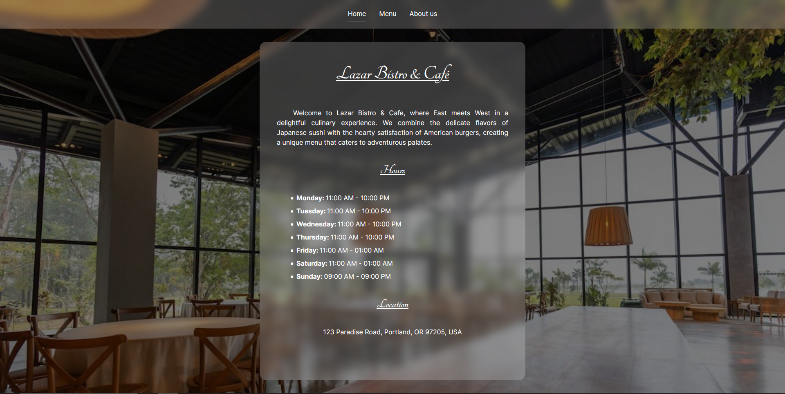

# Odin Restaurant Page

## About
This restaurant uses Webpack to bundle all the code into a single file. Three separate Webpack config files are used, one for development, one for production and a common one with shared declarations.
Features:
- A tab system to navigate between the three pages from one HTML file using dynamically injected Javascript.
- A custom scrollbar that fits with the website's theme.
- The information on the pages is stored as JSON data.
- The content of the pages is loaded using DRY Javascript code (no HTML).
## What I learned
The `package.json` file specifies the two scripts used:
1. `npm run dev` opens the webpack dev server and uses the development Webpack config file.
2. `npm run build` outputs the bundled code and assets into the `/dist` folder, together with optimisations made for the production environment.
```json
// package.json
{
  "scripts": {
    "build": "webpack --config webpack.prod.js",
    "dev": "webpack serve --open --config webpack.dev.js"
  }
}
```

The logic that bundles the image assets for the food items in the menu so the correct paths are loaded at runtime is stored in its dedicated file, `/src/components/images.bundle.js`:
```js
import sushiBurgerDeluxe from '../images/sushi-burger-deluxe.jpg';
import teriyakiChickenBurger from '../images/teriyaki-chicken-burger.jpg';
import tempuraFishTaco from '../images/tempura-fish-taco.jpg';
// ...

const images = [
  sushiBurgerDeluxe,
  teriyakiChickenBurger,
  tempuraFishTaco,
  // ...
];

export default images;
```
Thus, the `images` object can be loaded directly in the `menu.js` module file:
```js
import images from './images.bundle';
// ...
domItem.innerHTML = `
  
  <strong>${item.name}</strong>
  <p class="price">${item.price}</p>
`;
```

The `innerHTML` property acts as a string so content can be dynamically added using a for-loop:
```js
// home.js
homeData.hours.forEach(weekDay => {
  hoursList.innerHTML += `
    <li><p><span class="week-day">${weekDay.day}: </span>${weekDay.start} - ${weekDay.end}</p></li>
  `;
});
content.appendChild(hoursList);
```

The scrollbar is styled using the cross-browser-compatible `scrollbar-width` and `scrollbar-color` properties.
```css
#content {
  /* ... */
  scrollbar-width: thin;
  scrollbar-color: var(--bg) transparent;
}
```